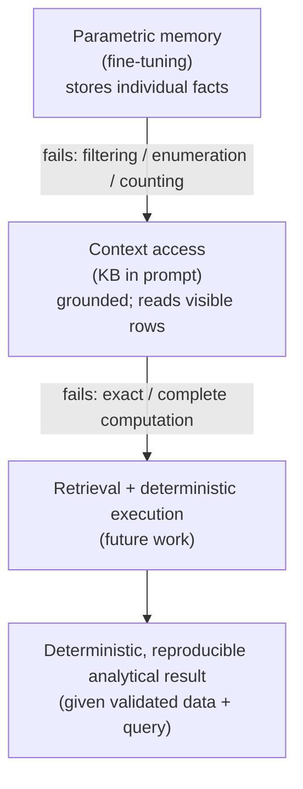
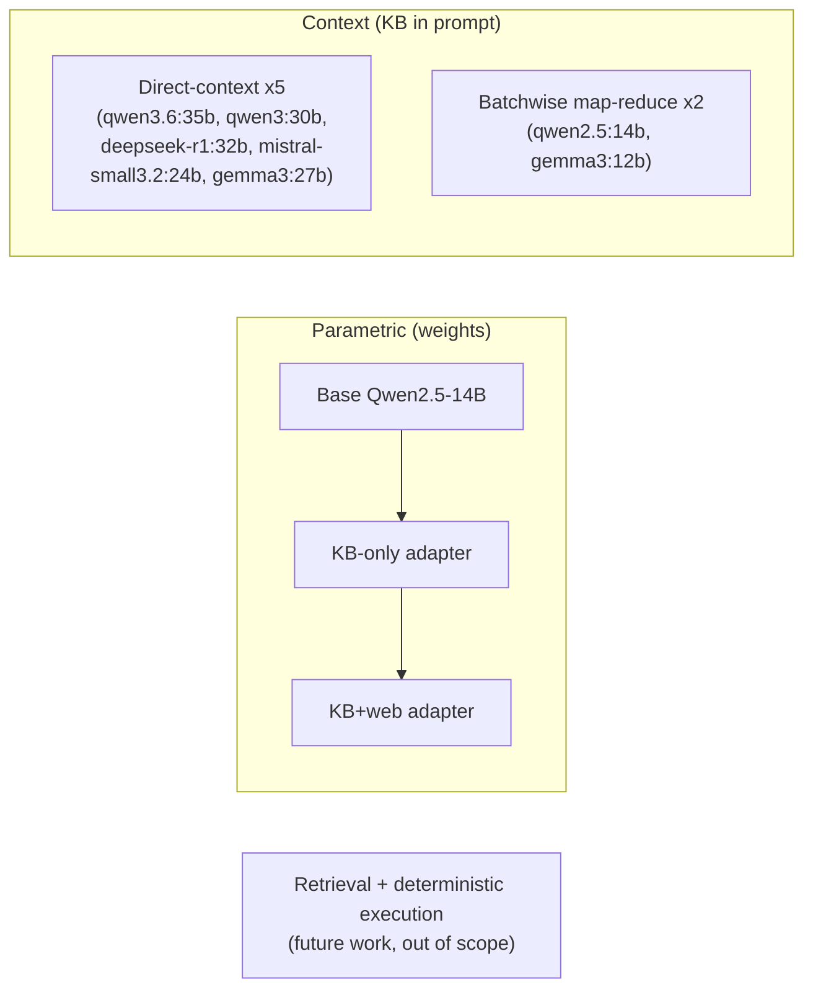

# Parametric Fine-Tuning versus In-Context Knowledge Access for Structured Georgia EV Supply-Chain Analytics

*Course project paper.*

## Abstract

Domain-specific question-answering systems must answer analytical questions over structured
records — enumerating suppliers of a given tier, counting companies that satisfy a constraint, or
identifying the county with the highest aggregate employment. A natural design question is *where
the domain knowledge should live*: written into a model's weights by fine-tuning, or supplied in
the prompt as context. This project experimentally characterises these two options over the GNEM
Georgia electric-vehicle (EV) supply-chain knowledge base (KB; 205 companies, 15 fields). We
fine-tune Qwen2.5-14B (4-bit QLoRA) into a KB-only and a KB+web adapter, evaluate them on a
purpose-built, capability-separated benchmark (GNEM-Bench-v1) measuring *fact recall*, *analytical
reasoning*, and *web-fact absorption*, and re-grade them with an external evaluation harness (a
deterministic composite scorer plus an LLM-as-judge rubric) against seven context-grounded
baselines that receive the KB in the prompt. The results are consistent: fine-tuning raises exact
KB fact recall from 0.03 to 0.78, but this does **not** transfer to analytical questions
(near-zero), because those require exhaustive retrieval and exact aggregation rather than isolated
recall; placing the KB in context substantially improves grounding and entity accuracy (reducing
observed out-of-KB company hallucinations to zero in the evaluated context systems) but still
leaves answers *incomplete* (completeness ≤ 0.57). The residual failure — omission and imperfect
aggregation — aligns closely with the class of problems that deterministic retrieval and execution
are designed to address. We report the study as a self-contained experiment, with confidence
intervals and
threats-to-validity, and note that the differences between parametric and context systems reflect
both the knowledge-access method and differences in model family and size. The findings demonstrate
that reliable analytical question answering over structured enterprise data requires explicit access
to the structured data beyond parametric memory alone; retrieval paired with deterministic execution
follows from these findings and is pursued as subsequent work.

## Relationship to the Thesis

This course project is a self-contained experimental study conducted as part of a broader
Master's thesis on question answering over the Georgia electric-vehicle manufacturing ecosystem.
The experiments reported here evaluate the capabilities and limitations of parametric fine-tuning
and in-context knowledge access using a fixed, human-validated benchmark. These results will be
incorporated into the thesis as an empirical study of knowledge representation and analytical
question answering. The broader thesis extends this work by investigating retrieval- and
tool-based methods for analytical business queries; however, those systems are outside the scope
of this course project.

## 1. Introduction and Objectives

The target application is an assistant over the GNEM Georgia EV supply-chain KB. The questions of
interest are analytical: they filter, count, group, aggregate, and rank records rather than recall
a single fact. Before adopting increasingly complex architectures such as retrieval-augmented
systems, it is useful to establish empirically what simpler knowledge-access mechanisms can and
cannot achieve, so that the design choice rests on measured evidence rather than assumption.

**Objective.** The objective of this project is to determine whether domain knowledge stored
through parameter-efficient fine-tuning, or supplied directly in context, can support reliable
analytical question answering over a structured manufacturing knowledge base. The study evaluates
seven capabilities: **fact recall, entity retrieval, counting, field accuracy, completeness,
grounding, and hallucination.**

**Research questions.** Each is matched to a concrete experiment:

- **RQ1.** How much does domain fine-tuning improve individual KB *fact recall*?
- **RQ2.** To what extent does improved parametric recall *translate into analytical performance*?
- **RQ3.** How does providing the KB *in context* affect grounding, completeness, and correctness?
- **RQ4.** Which remaining *failure modes* require deterministic tools?

**Figure 1 — Capability progression and the failure that motivates each next stage.**



```text
Figure 1 (ASCII)

   Parametric memory (fine-tuning): stores individual facts
                 |
                 v   fails: filtering / enumeration / counting
   Context access (KB in prompt): grounded; reads visible rows
                 |
                 v   fails: exact / complete computation
   Retrieval + deterministic execution (future work)
                 |
                 v
   Deterministic, reproducible analytical result (given validated data + query)
```

## 2. Related Work

**Retrieval-Augmented Generation (RAG).** Lewis et al. (2020) combined a parametric language model
with a non-parametric retrieval memory so that generation is grounded in retrieved documents. This
project studies two *endpoints* of the knowledge-access spectrum — knowledge held entirely in
parameters (fine-tuning) and knowledge supplied entirely in the prompt (context) — to quantify
what a selective retrieval step would need to add. Note that the context baselines evaluated here
are **not** RAG systems: they receive the full KB (or exhaustive batches of it) rather than a
retrieved subset.

**In-context learning and long-context models.** A large language model can also acquire
task-relevant information *at inference time* by having it placed in the prompt, without any
change to its parameters. Brown et al. (2020) showed with GPT-3 that models perform new tasks from
in-context examples alone (in-context learning), and subsequent long-context architectures made it
practical to place large evidence sets — here, the full 205-row KB — directly in the prompt.
In-context knowledge access is therefore the second of the two paradigms this project compares:
where fine-tuning writes knowledge into the weights, context supplies it transiently at inference,
trading a persistent parametric encoding for a fresh, fully visible evidence snapshot.

**Tool-using language models.** ReAct (Yao et al., 2023) interleaves reasoning with actions over
external sources; Toolformer (Schick et al., 2023) studies how a model learns which external tool
to call and when. These motivate delegating computation to external tools but do not establish
that a given domain assistant requires it; this project supplies that empirical premise for one
concrete domain.

**Parameter-efficient fine-tuning.** LoRA (Hu et al., 2022) freezes the base model and trains
small low-rank adapters; QLoRA (Dettmers et al., 2023) adds 4-bit quantisation. We use 4-bit
QLoRA for both fine-tuned systems.

## 3. Dataset and Benchmark

**Knowledge base.** GNEM: 205 Georgia EV / battery companies described by 15 structured fields,
which group into: *company identity* (name); *supply-chain classification* (tier/category,
industry group, EV supply-chain role, supplier/affiliation type); *products* (product/service);
*OEM relationships* (primary OEMs); *employment* (headcount); *location/geography* (address and
location, which embeds county, with latitude/longitude); and *EV relevance* (EV/battery relevance,
primary facility type, classification method). Some companies occupy multiple rows because they
operate several facilities (for example, Novelis Inc. and Sewon America Inc. each have three
facility rows); entity scoring therefore works over normalised company names rather than raw rows.
Although the KB contains only 205 companies, the benchmark emphasises analytical *operations* —
filtering, grouping, aggregation, and exhaustive retrieval — rather than dataset scale, which makes
it a suitable testbed for evaluating reasoning over structured enterprise data despite the modest
row count.

**Benchmark (GNEM-Bench-v1).** GNEM-Bench-v1 was developed specifically for this study to evaluate
analytical reasoning over structured enterprise data; it is not a pre-existing benchmark. It
comprises three capability-separated suites:
- **KB cloze recall** — deterministic single-field completions (e.g. `Company: JTEKT\nLocation:`)
  measuring parametric memorisation of individual facts.
- **GNEM-KB-42** — 42 human-validated analytical business questions with gold answers drawn from a
  human-validated spreadsheet. Composition: 22 multi-filter list, 2 direct lookup, 2 count, 2
  geographic aggregation, 2 top-k ranking, 1 maximum/minimum, and 11 open-ended *judgment*
  questions — i.e. **31 deterministic + 11 judgment**. The *judgment* questions are open-ended,
  subjective queries with no single deterministic gold answer — for example, which suppliers are
  *upgradeable* to EV power electronics, *pivot-ready*, positioned for future expansion, or of
  strategic importance — and are scored by entity overlap rather than exact match. Gold entity
  lists are the human-validated sets and are treated as exhaustive for the deterministic questions;
  entity matches are computed against the 205 KB company names.
- **GNEM-Web-18** — 18 web-fact questions authored only from pages *proven to be in the training
  set* and verified absent from (or, for one company, in conflict with) the KB, measuring
  in-training web-fact *absorption*. Eighteen questions were used because they cover distinct
  web-only facts while remaining feasible to author and human-validate by hand.

## 4. Systems and Experimental Methodology

**Three knowledge paradigms.**
- *Parametric memory* — Qwen2.5-14B adapted by 4-bit QLoRA (rank 64, rsLoRA). Two variants: a
  **KB-only** adapter (all 205 records, `train_all`, 50 epochs; training loss 0.032) and a
  **KB+web** adapter that additionally trains on a ~9,700-page Georgia-EV web corpus. The KB+web
  run is *exposure-controlled*: each KB record is presented 50× (matching KB-only exposure) and the
  entire web training split once, giving 12,447 training examples in one epoch and an effective
  mixture of ≈28% KB / 72% web tokens (training loss 0.256). Base Qwen2.5-14B (no adapter) is the
  third parametric system.
- *Context access — seven baselines that receive the KB in the prompt:*
  - **Direct-context** (full KB in one prompt): `qwen3.6:35b-a3b`, `qwen3:30b`, `deepseek-r1:32b`,
    `mistral-small3.2:24b`, `gemma3:27b`.
  - **Batchwise map-reduce** (map over disjoint KB batches → verify → reduce): `qwen2.5:14b`,
    `gemma3:12b`.

**Figure 2 — Systems evaluated in this study.** The three parametric systems share one backbone;
the seven context systems supply the KB in the prompt. Retrieval + deterministic execution is
shown for orientation but is out of scope here.



*(The three groups are distinct paradigms compared in this study, not stages of a single evolving
system; the internal Base → KB-only → KB+web arrows denote successive adapter variants of one
backbone.)*

```text
Figure 2 (ASCII)

Parametric (weights):        Base Qwen2.5-14B -> KB-only -> KB+web
Context (KB in prompt):      Direct-context x5  |  Batchwise map-reduce x2
Future work (out of scope):  Retrieval + deterministic execution
```

**Procedure.**
1. Normalise the 205-row KB (company/category/location/employment fields; add row_ids).
2. Train the KB-only adapter (`train_all`, 50 epochs).
3. Train the KB+web adapter with per-source exposure control (KB 50×, web 1×).
4. Run Base, KB-only, and KB+web on GNEM-Bench (cloze recall, GNEM-KB-42, GNEM-Web-18).
5. Run the five direct-context and two batchwise systems on the same 42 questions.
6. Score all outputs with the Deterministic-V2 composite.
7. Apply DeepEval (LLM-as-judge) as a secondary qualitative signal.
8. Compare capability and failure-mode differences across systems.

**Experimental control (important).** This is a **system-level comparison, not a controlled model
ablation.** Most context systems use different model families and sizes from the Qwen2.5-14B
parametric backbone, so a performance difference may reflect *both* the knowledge-access method and
the underlying model capability. The **batchwise Qwen2.5-14B system provides the closest same-family
comparison** (same base model, KB supplied in context), while the larger direct-context systems
represent stronger practical baselines. Conclusions about "context vs parametric" are therefore
strongest where the same-family comparison agrees with the broader trend, and are stated as
system-level rather than architecture-controlled.

**Evaluation harness provenance.** The Deterministic-V2 scorer and the DeepEval rubric were
developed for a separate context-model experiment and were applied **unchanged** to the parametric
outputs; the scoring rules were not modified after observing the parametric results. Using the same
code for all systems gives a common footing for comparison.

**Reproducibility.** All configuration files, prompts, scoring scripts, benchmark files (including
the frozen gold set), and per-system model outputs are version-controlled, enabling reproduction of
the reported results; generation is greedy (deterministic) under a fixed seed.

## 5. Evaluation Metrics

**Deterministic-V2 composite.** A weighted, reproducible score per system:

```
research_score = 0.45 · entity_F1
              + 0.20 · count_accuracy
              + 0.15 · field_value_accuracy
              + 0.10 · (1 − true_hallucination_rate)
              + 0.05 · format_core_ok_rate
              + 0.05 · reliability
```

`entity_F1` is precision/recall/F1 of company (or county) mentions against the gold set;
`count_accuracy` is exact match of an extracted count; `field_value_accuracy` checks that required
KB field values appear; `true_hallucination_rate` uses a KB-driven mention taxonomy (company-shaped
mentions absent from the KB); `format_core_ok`/`reliability` are format compliance and
answered-rate. `format_core_ok` and the row_id-consistency checks are **context-format specific**
(they expect an Evidence table), so they read low for the free-text parametric answers and are
reported but not over-interpreted for those systems.

**Count-accuracy caveat.** The `count_accuracy` component is computed over only the questions where
a count is extractable — a **small denominator of 5–7 questions**. For KB+web this is 2 of 5
(0.40), but the **mean absolute count error is ≈159** (base 9, KB-only 112), because the extractor
takes a numeric token from often-verbose or hallucinated text. The 40% figure therefore **does not
indicate reliable counting ability** and should be read alongside the large error magnitude.

**DeepEval (LLM-as-judge).** Six 0–1 rubric dimensions scored by a local `gpt-oss:120b` judge.
Because DeepEval is itself an LLM-based judge — susceptible to leniency and to overlooking exact
list/count errors — the deterministic metrics are treated as the **primary** evaluation, and
DeepEval is used only as a **secondary** signal for qualitative aspects such as completeness,
grounding, and readability that the deterministic scorer does not capture directly.
Because parametric answers cite no evidence rows, we report a **core answer-quality mean**
(completeness, correctness, company-grounding, usefulness) for all systems, and a **traceability**
score (faithfulness, evidence-grounding) only for context systems that receive evidence.

**Uncertainty.** For the GNEM-Bench binary suites we report **95% Wilson confidence intervals**
(Web-18 has only 18 items, so intervals are wide). The Deterministic-V2 and DeepEval composites are
reported as point magnitudes **without** intervals or paired significance tests; small
between-system differences are therefore described as differences in magnitude, not significance.

## 6. Results

The results consistently show a **progression** across the three paradigms: fine-tuning improves
*fact memorisation*, context improves *grounding and entity accuracy*, and *analytical computation*
remains unresolved by either — the pattern that the rest of this section quantifies and that the
discussion interprets.

**Figure 3 — Headline contrast (best system per paradigm).** Bars are proportional (20 blocks = 1.0).

```text
Analytical composite (Det-V2, best system)
  Context     0.846  ████████████████▉
  Parametric  0.311  ██████▏

KB fact recall (cloze exact, best system)
  Parametric  0.782  ███████████████▋
  Context      N/A   (cloze is a parametric-memorisation probe; not run on context systems)
```

*Context dominates analytical answering; parametric memory dominates isolated fact recall — two
different capabilities, not two points on one scale.*

**Capability matrix (best result per paradigm).**

| Capability (metric) | Parametric (best) | Context (best) | Interpretation |
|---|---|---|---|
| KB fact recall (cloze exact) | 0.782 | N/A | fine-tuning stores individual facts |
| Analytical composite (Det-V2) | 0.311 | 0.846 | context greatly improves analytical answering |
| Entity-F1 (list correctness) | 0.104 | 0.813 | parametric cannot enumerate correct sets |
| Count accuracy | 0.400 (noisy; see §5) | 0.778 | context helps; exact execution still needed |
| Out-of-KB hallucination | 9.5% | 0.0% (observed) | evidence access reduces unsupported entities |
| Completeness (DeepEval) | 0.000 | 0.571 | even context systems omit valid rows |

**Parametric systems (GNEM-Bench-v1, with 95% Wilson CIs where binary).**

| Metric | Base | KB-only | KB+web |
|---|---|---|---|
| KB cloze recall (exact) | 0.027 | **0.782** | 0.608 |
| GNEM-KB-42 (strict) | 5.0% [1–16] | 2.5% [0–13] | 7.5% [3–20] |
| GNEM-Web-18 (absorption) | 22.2% [9–45] | 5.6% [1–26] | **38.9% [20–61]** |

**Ten-system Deterministic-V2 composite.** Best direct-context system `qwen3.6:35b-a3b` = **0.846**;
`qwen2.5:14b` batchwise (same-family) = 0.588; lowest context (`gemma3:27b`) = 0.435. Parametric:
kb_web = **0.311**, base = 0.210, kb_only = 0.203. Component contrast: entity-F1 0.104 (kb_web) vs
0.529 (qwen2.5:14b) vs 0.813 (qwen3.6:35b); true-hallucination 9.5% (kb_web) vs 0.0% for context.

**DeepEval core answer-quality mean:** parametric 0.13–0.17 (kb_web 0.171) vs context 0.36–0.79
(qwen3.6:35b 0.788; qwen2.5:14b 0.607). The parametric core mean is carried almost entirely by
*company-grounding* (kb_web 0.559) while *completeness* and *correctness* are ≈0; context systems
are high on grounding (0.95–0.99) and usefulness (0.73–0.94) but only 0.24–0.57 on completeness.
Traceability (context only) ranges 0.18–0.88 (qwen3.6:35b 0.880; qwen2.5:14b 0.767).

**Entity grounding (mention classification).** Fine-tuning converts the model from a fabricator
into an entity-grounded system:

| System | Real KB companies named | Fabricated (out-of-KB) | Misspelled |
|---|---|---|---|
| base | 5 | 16 | 4 |
| kb_only | 19 | 5 | 1 |
| kb_web | 20 | 8 | 0 |

## 7. Failure Analysis and Discussion

**RQ1 — Fine-tuning substantially improves fact recall.** Exact cloze recall rises from 0.027
(base) to **0.782** (KB-only), and the KB+web adapter retains 0.608. Fine-tuning demonstrably
stores individual company records in the weights.

**RQ2 — Improved recall does *not* translate into analytical performance.** Both fine-tuned
adapters remain near zero on the strict GNEM-KB-42 criterion and reach only 0.20–0.31 on the
Deterministic-V2 composite — barely above base and far below any context system; mean entity-F1 is
0.05–0.10 vs 0.53–0.81 for context. In this experiment, fine-tuning strongly improved isolated fact
recall but did not produce reliable exhaustive analytical performance. The reason is structural:
questions such as *"list all Tier 1/2 battery suppliers"* or *"which county has the highest total
employment among Tier-1 suppliers?"* require complete retrieval, filtering, grouping, and
aggregation over the whole table. Illustratively, asked to list eighteen companies the KB-only
adapter degenerated into repeated record-boundary tokens; asked for the Gwinnett-County maximum it
returned one unrelated but well-formed memorised record.

**RQ3 — Context substantially improves grounding, but not completeness.** Supplying the KB in the
prompt raises entity-F1, count accuracy, and field accuracy sharply and drives observed out-of-KB
hallucination to zero, yet completeness stays 0.24–0.57: the characteristic context failure is
*omission* — a partial list or an approximate aggregate — not fabrication. The batchwise Qwen2.5-14B
system typifies this (company-grounding 0.952, usefulness 0.926, completeness 0.243, count accuracy
0.222). Importantly, this system shares the *same backbone* as the parametric models, so its large
lead over KB+web (composite 0.588 vs 0.311; entity-F1 0.529 vs 0.104) isolates the effect of
knowledge access from model family and size: with the same Qwen2.5-14B weights, seeing the KB in
context is far more effective than encoding it in the parameters. In this benchmark, providing the
KB in context shifted the dominant failure mode from fabricated entities toward incomplete retrieval
and computation.

**RQ4 — The residual failures require deterministic tools.** Across both paradigms the unremoved
errors are exhaustive-retrieval and exact-aggregation failures: missed rows, incomplete
enumeration, and imperfect sums/rankings — the operations a database engine performs
deterministically. This motivates delegating filtering/counting/grouping/aggregation to
deterministic tools while reserving the model for question understanding and grounded synthesis.

**Failure-mode contrast.** Parametric failure is a *knowledge-integrity* problem (fabricated
companies, wrong attribute binding, incomplete recall, wrong counts, format degeneration): the
model does not reliably *have* the correct facts. Context failure is an *execution* problem
(omission, partial aggregation, incomplete enumeration): the model *has* the facts but does not
reliably process all of them. Additional fine-tuning alone did not provide such a mechanism for
exhaustive retrieval and exact aggregation in these experiments, and context alone did not fully
close the gap, because the bottleneck is an LLM performing set-level computation token-by-token.

## 8. Threats to Validity

**Internal.** Prompt templates differ across paradigms (parametric received the bare question;
context systems received a structured Evidence-table format), which affects both content and the
format-dependent metrics. Answers were parsed by per-type parsers whose extraction (especially of
counts) is imperfect. Generation was capped at `max_new_tokens = 256`, and the parametric outputs
frequently reached this cap — **on the 42 KB questions the limit was hit by 42/42 (KB+web), 41/42
(KB-only), and 35/42 (base) answers** — so parametric completeness and entity-F1 are likely
*under*-estimated. DeepEval uses a single LLM judge with known leniency/omission-blindness, so it
is treated only as a secondary signal. Some gold answers involve interpretive judgment.

**Construct.** Cloze recall is a proxy for parametric knowledge and may under- or over-represent
what the weights encode; 42 questions may not cover all business-analytics patterns; and DeepEval's
usefulness/company-grounding dimensions capture communication quality and grounding rather than
full analytical correctness. The benchmark was also developed by the same researcher who implemented
the systems, which is a potential source of benchmark bias; to mitigate this, all gold answers were
manually validated before evaluation and the deterministic scoring harness was authored for a
separate context-model experiment and applied unchanged.

**External.** The parametric study uses one domain, one KB size (205 companies), primarily one
backbone (Qwen2.5-14B), and locally quantised models; GNEM-Web-18 measures in-training absorption,
not held-out generalisation. Results should be generalised cautiously.

## 9. Practical Implications

For a practitioner building an assistant over structured enterprise data, the results suggest a
workload-driven choice of knowledge-access method. For workloads dominated by repeated lookup of a
relatively stable domain, parametric fine-tuning can be beneficial — it answers single-entity
attribute queries and grounds the model in real domain entities (reducing fabricated names),
without a large per-query context cost (though direct-context systems also handled lookup well
here). For *business analytics that must remain grounded in the data* — describing, listing, or
explaining records the model can see — supplying the records *in context* is preferable, because it
sharply improves entity accuracy and reduced observed fabrication to zero in the evaluated systems.
But if the workload requires *exact counts, aggregation, ranking, or exhaustive retrieval*, neither
parametric memory nor in-context prompting is sufficient on its own, and the
filtering/counting/grouping/aggregation should be delegated to **deterministic retrieval and
execution** (e.g. a relational query), with the language model reserved for question understanding
and grounded synthesis. In short: repeated lookup over a stable domain can benefit from
fine-tuning, grounded description favours context, and analytical computation requires deterministic
tools.

## 10. Conclusion

This project experimentally establishes the capability boundaries of parametric memory and
in-context knowledge for structured Georgia-EV analytics. Fine-tuning substantially improves
isolated KB fact recall (0.03 → 0.78, RQ1) but does not translate into analytical performance
(near-zero on GNEM-KB-42; RQ2), because analytical questions require exhaustive retrieval and exact
aggregation rather than recall. Supplying the KB in context substantially improves grounding and
entity accuracy and reduced observed out-of-KB fabrication to zero in the evaluated context
systems, but answers remain incomplete (completeness ≤ 0.57; RQ3). The residual failures across both paradigms are omission and imperfect
aggregation (RQ4). A secondary result is that fine-tuning markedly improved domain-entity
recognition (real-company naming 5 → 20; fabrications 16 → 8; misspellings → 0), which shows that
parametric adaptation instils reliable entity *recognition* even where it does not instil analytical
*reasoning*. Because the comparison is system-level rather than model-controlled, these conclusions
are strongest where the same-family Qwen2.5-14B comparison agrees with the broader trend, which it
does.

These findings indicate that reliable analytical answering over the structured KB requires explicit
data access and deterministic computation, which parametric memory and in-context prompting do not
provide. The design and evaluation of retrieval- and tool-based systems — pairing selective
retrieval with deterministic execution (e.g. relational/SQL aggregation) — are outside the scope of
this course project. This study therefore establishes the empirical motivation for the
retrieval-based system developed in the remainder of the thesis.

## References

*(Author/year/title are given; final venue and formatting details should be verified against the
primary sources before submission.)*

1. Brown, T. B., Mann, B., Ryder, N., et al. (2020). *Language Models are Few-Shot Learners.*
   Advances in Neural Information Processing Systems (NeurIPS).
2. Lewis, P., Perez, E., Piktus, A., et al. (2020). *Retrieval-Augmented Generation for
   Knowledge-Intensive NLP Tasks.* Advances in Neural Information Processing Systems (NeurIPS).
3. Yao, S., Zhao, J., Yu, D., et al. (2023). *ReAct: Synergizing Reasoning and Acting in Language
   Models.* International Conference on Learning Representations (ICLR).
4. Schick, T., Dwivedi-Yu, J., Dessì, R., et al. (2023). *Toolformer: Language Models Can Teach
   Themselves to Use Tools.* Advances in Neural Information Processing Systems (NeurIPS).
5. Hu, E. J., Shen, Y., Wallis, P., et al. (2022). *LoRA: Low-Rank Adaptation of Large Language
   Models.* International Conference on Learning Representations (ICLR).
6. Dettmers, T., Pagnoni, A., Holtzman, A., & Zettlemoyer, L. (2023). *QLoRA: Efficient Finetuning
   of Quantized LLMs.* Advances in Neural Information Processing Systems (NeurIPS).
7. Qwen Team, Alibaba (2024). *Qwen2.5 Technical Report.* arXiv:2412.15115.
8. Qwen Team, Alibaba (2025). *Qwen3 Technical Report.* arXiv preprint.
9. Gemma Team, Google DeepMind (2025). *Gemma 3 Technical Report.* Google DeepMind.
10. Mistral AI (2024). *Mistral Small.* Model release / technical documentation.
11. DeepSeek-AI (2025). *DeepSeek-R1: Incentivizing Reasoning Capability in LLMs via Reinforcement
    Learning.* arXiv preprint.
12. Confident AI (2024). *DeepEval: The LLM Evaluation Framework.* Open-source software.

## Appendix

### A. Inference configuration

| Setting | Value |
|---|---|
| Decoding | Greedy |
| Sampling | Disabled |
| Max new tokens | 256 |
| Parametric backbone | Qwen2.5-14B |
| Quantization | 4-bit (NF4) |
| LoRA rank | 64 |
| rsLoRA | Enabled |
| Seed | 42 |
| DeepEval judge | gpt-oss:120b (local, temperature 0) |

### B. Prompt structures (summary; full templates in the evaluation code)

- **Parametric (Base / KB-only / KB+web).** The raw question only, as a completion prompt; no
  system prompt and no output-format instruction (these are base, non-instruct completion models).
- **Direct-context.** The full KB is placed in the prompt; the model is asked to produce a fixed
  structure — a natural-language `Answer`, an `Evidence` table (row_id, Company, fields), a `Count`
  equal to the number of Evidence rows, and `Supporting row_ids` — under explicit consistency rules
  (every named company must appear in Evidence with a real KB row_id, and Count must equal the
  number of Evidence rows). The full-KB prompt is large — **≈40,000 tokens** (measured
  prompt-evaluation counts of 39k–42k across the five direct-context models) — which is the primary
  reason for the batchwise variant: on smaller-context models the 205-row KB does not fit (or is
  costly) in a single prompt, so it is scanned in disjoint batches instead.
- **Batchwise map-reduce.** *Map:* select candidate row_ids from each disjoint KB batch; *Verify:*
  confirm the candidate rows; *Reduce:* answer from the union of verified rows using the same
  `Answer/Evidence/Count/Supporting row_ids` structure as the direct-context prompt.

### C. Deterministic-V2 scoring formula

See §5. Reproduced here for reference:
`0.45·entity_F1 + 0.20·count_accuracy + 0.15·field_value_accuracy + 0.10·(1−true_hallucination_rate)
+ 0.05·format_core_ok_rate + 0.05·reliability`.
