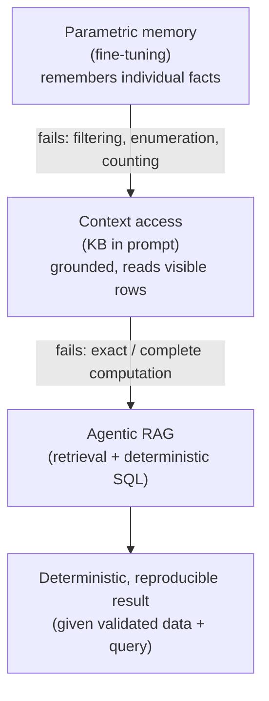
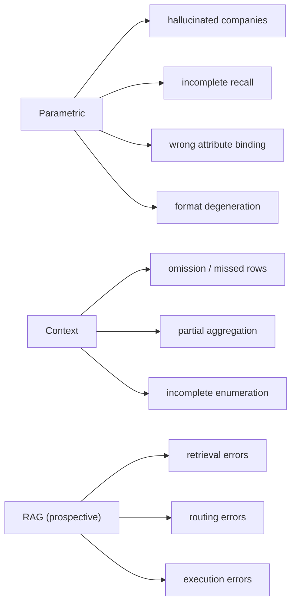

# Parametric Memory, Context, and Retrieval for a Georgia EV Manufacturing Assistant: Findings and Discussion

## 1. Introduction

This chapter reports and interprets the experiments conducted to determine whether
parametric fine-tuning alone can serve as the knowledge substrate for an AI assistant
over Georgia's electric-vehicle (EV) manufacturing ecosystem. The domain knowledge base
(KB) is a structured table of 205 companies described by 15 fields (company, tier,
industry group, location, EV supply-chain role, primary OEMs, employment, product/service,
and related attributes). The assistant must answer realistic business questions over this
KB — for example, enumerating suppliers of a given tier, counting companies that satisfy a
constraint, or identifying the county with the highest aggregate employment.

The experiments deliberately compare three fundamentally different ways of supplying
knowledge to a large language model (LLM), because each represents a distinct hypothesis
about where domain knowledge should live:

- **Parametric memory** — the knowledge is written into the model weights by fine-tuning
  (a KB-only adapter and a KB+web adapter over Qwen2.5-14B, 4-bit QLoRA, rank 64 + rsLoRA).
- **Context-based knowledge** — the structured KB is placed directly in the prompt at
  inference time (the *direct-context* and *batchwise map-reduce* systems evaluated against
  the same 42-question benchmark).
- **Retrieval-based reasoning** — a future Agentic RAG system that retrieves KB rows and
  performs deterministic computation over them; this stage is motivated, not yet built.

The central objective was **not** to rank models by accuracy, but to characterise *which
capability each paradigm actually provides*. As will be shown, the three paradigms are not
points on a single quality scale; they supply different and partially non-overlapping
capabilities, and the failure of any one of them is informative about the design of the
system that should follow.

Two evaluation instruments are used. **GNEM-Bench-v1** is a purpose-built benchmark that
separates three capabilities: (i) *KB cloze recall*, measuring parametric memorisation of
individual KB facts; (ii) *GNEM-KB-42*, 42 human-validated analytical business questions;
and (iii) *GNEM-Web-18*, eighteen web-fact questions drawn from pages proven to be in the
training corpus. The second instrument reuses an external, independently authored evaluation
harness (the *LLM_Context* Deterministic-V2 scorer and a DeepEval LLM-as-judge rubric using
a local `gpt-oss:120b` judge), so that the parametric systems can be graded with **exactly
the same code** as seven context-grounded systems and compared on a common footing. In
contrast to many commonly used open-domain and factoid-oriented RAG evaluations, GNEM-Bench
targets **structured business analytics over a domain-specific manufacturing knowledge base**
— selection, counting, grouping, aggregation, and ranking over a fixed set of records — a
setting in which the correct answer is defined by an operation over the whole table rather
than by the recall of an isolated fact. (Representative RAG benchmarks should be cited here in
the thesis version.)

The central result can be previewed as a capability matrix. Each row is a distinct capability;
the columns give the best parametric and best context result and the interpretation the rest of
this chapter defends (full per-system tables are in the Appendix).

| Capability (metric) | Best parametric | Best context | Interpretation |
|---|---|---|---|
| KB fact recall (cloze exact) | 0.782 | N/A | Fine-tuning stores individual facts |
| Analytical composite (Det-V2) | 0.311 | 0.846 | Visible evidence greatly improves analytical answering |
| Entity-F1 (list correctness) | 0.104 | 0.813 | Parametric systems cannot enumerate the correct sets |
| Count accuracy | 0.400 | 0.778 | Context helps, but exact execution is still needed |
| Out-of-KB hallucination | 9.5% | 0.0% (observed) | Evidence access reduces unsupported entities |
| Completeness (DeepEval) | 0.000 | 0.571 | Even context systems omit valid rows |

Read together, these rows are the argument of the chapter: parametric fine-tuning maximises the
first row, context access dominates the middle rows, and no evaluated system approaches the last
row — the empirical gap that motivates retrieval with deterministic computation.

**Hypotheses.** The experiments were designed to examine three hypotheses, each tested by one
of the findings below:

- **H1** — Parametric fine-tuning *substantially* improves domain *fact recall* but does not
  produce a corresponding improvement in *analytical reasoning* over the structured KB (tested
  in Finding 1).
- **H2** — Providing the structured KB *in context* *substantially* improves grounded analytical
  answering relative to parametric memory alone (tested in Finding 3).
- **H3** — Questions that require exhaustive enumeration or aggregation demand *deterministic
  execution* rather than additional parametric memorisation (tested across Findings 1 and 3 and
  motivating §6).

Consistent with the evidence-calibrated stance of this chapter, these are treated as hypotheses
that the measured results *support*, not as proven laws.

**Figure 1 — Capability progression and the failure that motivates each next stage.**



```text
Figure 1 (ASCII)

        Parametric memory (fine-tuning)
        +--------------------------------+
        |  remembers individual facts    |
        +--------------------------------+
                       |
                       v   fails: filtering / enumeration / counting
        Context access (KB in prompt)
        +--------------------------------+
        |  grounded; reads visible rows  |
        +--------------------------------+
                       |
                       v   fails: exact / complete computation
        Agentic RAG (retrieval + deterministic SQL)
        +--------------------------------+
        |  retrieve rows, then compute   |
        +--------------------------------+
                       |
                       v
        Deterministic, reproducible result
        (given validated data + query)
```

---

## 2. Finding 1 — Parametric memory stores facts but does not provide structured analytical reasoning

Fine-tuning was highly effective at the task it was designed for: memorising the KB. On the
KB cloze-recall probe (single-field completions such as `Company: JTEKT\nLocation:`), exact
recall rose from **0.027** for the base model to **0.782** for the KB-only adapter — a
roughly thirty-fold improvement. The large improvement in cloze recall demonstrates
substantial parametric retention of the 205 company records — though recall of 0.782 (not
1.0) indicates the encoding is strong but imperfect.

That memorisation, however, did **not** translate into the ability to answer analytical
questions over the same records. On GNEM-KB-42, the KB-only adapter scored close to zero on
the benchmark's strict per-question criterion, and under the more lenient Deterministic-V2
composite (which awards partial credit for entity overlap, field-value presence, and correct
counts) it reached only **0.203** — nearly identical in magnitude to the base model's **0.210**, and
neither demonstrated useful analytical performance — and far below any context-grounded
system. (No confidence intervals or paired significance tests were computed for the
Deterministic-V2 composite, so this is a statement of magnitude, not of statistical
equivalence.) Entity-level list accuracy was the
clearest signal: the KB-only adapter's mean entity-F1 was **0.051** and the KB+web adapter's
**0.104**, versus **0.529–0.813** for context systems.

The dominant limitation is structural rather than merely a lack of training exposure:
additional fine-tuning may improve recall on narrow lookup or format patterns, but it does not
provide a guaranteed mechanism for exhaustive retrieval and deterministic aggregation. Consider
two representative questions:

> *"List all Tier 1/2 battery suppliers in Georgia."*
>
> *"Which county has the highest total employment among Tier-1 suppliers?"*

The first requires **complete retrieval** followed by **filtering**: every one of the 205
records must be examined and those matching *(tier ∈ {Tier 1, Tier 1/2}) ∧ (role relates to
battery)* returned — all of them, not a plausible subset. The second additionally requires
**grouping** by county, **aggregation** (summing employment within each group), and
**arg-max** selection. These are set-level and relational operations over the *entire*
dataset. Parametric memory offers none of them. A fine-tuned model recalls facts by
content-addressable association: prompted with a company it can often reproduce that
company's stored fields, but it has no guaranteed or directly inspectable mechanism for
*enumerating all records* stored diffusely in its parameters, for *holding a running
aggregate*, or for *guaranteeing completeness*. Its weights are a lossy associative store,
**not a queryable database**.

The observed failure signatures confirm this. Asked to list all eighteen Tier 1/2 companies
(GNEM question 1, gold count = 18), the KB-only adapter degenerated into a repeated
record-boundary token stream (`</record> > > …`), having learned the *surface form* of KB
records without the ability to enumerate them; the KB+web adapter instead produced the
fluent but fabricated assertion *"Georgia has 100 Tier 1/2 suppliers,"* inventing a count.
On the Gwinnett-County maximum-employment question (gold = WIKA USA), the KB-only adapter
emitted a single unrelated but well-formed memorised record (ZF Gainesville LLC) — the right
*format*, the wrong *retrieval and computation*. Across the analytical categories the model
behaved as a **probabilistic completion system** rather than a **reliable executor over the
full table**.

The legitimate conclusion is narrow and firm: **high parametric recall does not imply
analytical capability.** Memorising a dataset and reasoning over a dataset are different
competencies, and fine-tuning delivers only the former.

---

## 3. Finding 2 — Adding web knowledge changes what the model remembers

The second experiment asked whether a single model could hold two corpora at once — the
structured KB and a ~9,700-page Georgia-EV web corpus — and what the interaction costs. To
make the comparison clean, the KB+web run was **exposure-controlled**: every KB record was
presented 50 times (matching the KB-only baseline's exposure) while the entire web training
split was presented once, yielding an effective training mixture of ~28% KB / ~72% web
tokens across 12,447 examples in a single epoch.

The results show a coherent trade-off between **knowledge absorption** and **knowledge
retention**:

- *Absorption improved.* On GNEM-Web-18, accuracy rose from **22.2%** (base) to **38.9%**
  (KB+web), a gain of +16.7 points over base and +33.3 over the KB-only adapter. The KB+web
  model learned facts that exist only in the web corpus — for example, that *SK On is working
  with Hyundai on the Cartersville joint-venture plant* (question web_q01), which the base
  model answered incorrectly ("…working with **Ford**") and the KB+web model answered
  verbatim from its training data.
- *KB knowledge was largely retained.* KB cloze recall remained high at **0.608**, still an
  order of magnitude above the base model's 0.027.
- *But retention was partially reduced.* Cloze recall fell from **0.782** (KB-only) to
  **0.608** (KB+web) — a ~0.17 absolute, ~22% relative decline.

This behaviour is expected when a fixed parameter budget must encode two corpora that compete
for the same weights. Additional web training coincided with a shift toward web-style outputs
and a reduction in exact KB recall, consistent with interference between the two training
objectives; the internal representational mechanism was not directly measured. A revealing
special case is **Anovion Technologies**, which is a **KB↔web conflict** case rather than a
KB-absent one: the structured KB stores an *incorrect* product for this company ("molded floor
covering / floor mats"), whereas the web corpus repeatedly and correctly describes it as a
manufacturer of *synthetic graphite anode materials*. Presented with the conflict, the KB+web
model **preferred the web-consistent fact over the conflicting KB entry**. This illustrates
both directions of the trade-off simultaneously: web adaptation can *correct* stale or wrong
structured data, but by the same competition for parameters it can also *displace* correct KB
values elsewhere. A single set of weights cannot be independently optimal for two sources; it
encodes a blended compromise.

A secondary but important observation is that the KB-only adapter showed *lower* Web-18
performance than the base model (5.6% vs 22.2%), consistent with partial forgetting of, or
interference with, pretrained web knowledge caused by domain-specific fine-tuning;
re-introducing the web corpus reversed it. The practical lesson is that "which corpus the model
remembers" is a design variable controlled by exposure, not a monotonic accumulation of
knowledge.

---

## 4. Finding 3 — Context is substantially more effective than parametric memory for structured business questions

When the same 42 questions were answered by systems that received the structured KB *in the
prompt*, performance improved markedly across every deterministic dimension. Under the
identical Deterministic-V2 scorer, the strongest context system reached a composite of
**0.846** (qwen3.6:35b, direct context) against the best parametric system's **0.311**
(KB+web). The gap is driven by the components that matter for structured questions:

| Metric | Best parametric (KB+web) | qwen2.5:14b (batchwise, in-context) | qwen3.6:35b (direct context) |
|---|---|---|---|
| Entity-F1 | 0.104 | 0.529 | 0.813 |
| Count accuracy | 0.40 | 0.222 | 0.778 |
| Field-value accuracy | 0.295 | 0.704 | 0.827 |
| True-hallucination rate | 0.095 | 0.000 | 0.000 |

Placing the rows in context lets the model apply its **pretrained reasoning** to *material it
can actually see*, rather than to a lossy recollection. It can copy company names correctly
(raising entity-F1 and eliminating fabricated companies), read attribute values off the
provided rows (raising field-value accuracy), and count the items it has been given (raising
count accuracy). Grounding is the most decisive change: in this evaluation, context systems
produced **no measured out-of-KB company hallucinations**, likely because the prompt supplied
the relevant entity set and reduced the need for unsupported recall (context does not
mathematically constrain the model's vocabulary — a model can still name companies absent from
the prompt — so this is an observed rate, not a guarantee). This is corroborated by the
DeepEval judge, under which context systems score very high on *company-grounding* (0.95–0.99)
and *usefulness* (0.73–0.94).

Crucially, however, context does **not** solve the task. Even the best context systems fall
well short of completeness. DeepEval *completeness* — how much of the gold answer's content is
actually covered — is only **0.571** for the strongest system and **0.243** for the
qwen2.5:14b batchwise system, and count accuracy for most context systems sits between 11% and
22%. The characteristic context-system failure is not fabrication but **omission**: given all
205 rows, the model returns a *partial* list (a subset of the true set), or performs an
*approximate* aggregation that miscounts or misranks. The qwen2.5:14b batchwise system is the
clearest example of this pattern — it is highly grounded (company-grounding 0.952) and highly
readable (usefulness 0.926) yet substantially incomplete (completeness 0.243, count accuracy
0.222). In other words, context turns a *fabrication* problem into a *coverage-and-computation*
problem. The model is now reliably talking about the right entities, but it is still doing the
enumeration and aggregation *in natural language, by hand*, and it does so imperfectly.

---

## 5. Failure Analysis

Because the two paradigms fail through different mechanisms, their errors must be analysed
separately.

**Parametric models** exhibit *recollection* failures:

- *Fabricated companies (hallucination).* The base model named far more non-existent than real
  companies (16 out-of-KB fabrications vs 5 genuine KB companies across the analysed answers).
  Fine-tuning sharply improved this — the KB-only and KB+web adapters named mostly *real* KB
  companies (19 and 20 respectively) with few or no misspellings — but the base rate of
  hallucination for an ungrounded parametric model is high (true-hallucination answer rate
  21.4%).
- *Incorrect attribute binding.* A recalled company is often paired with the wrong field value,
  because association is approximate.
- *Incomplete recall and wrong counts.* The model cannot enumerate a full set and cannot count
  one it never fully retrieved (count accuracy 0% for base and KB-only).
- *Format degeneration.* Under list prompts the model collapses into repeated structural tokens
  (`</record> > >`), reproducing learned surface form without content.

**Context models** exhibit *coverage and computation* failures:

- *Missed rows / incomplete retrieval.* Relevant records present in the prompt are omitted from
  the answer.
- *Imperfect aggregation.* Sums, maxima, and rankings computed in prose are frequently slightly
  wrong.
- *Omission errors rather than fabrication.* The systems remain grounded (0% hallucination) but
  incomplete (completeness ≤ 0.57).

**Figure 2 — Failure-mode taxonomy by paradigm** (the RAG branch is prospective, anticipating the
error classes the next-stage system must itself guard against).



```text
Figure 2 (ASCII)

Parametric
  ├── hallucinated companies
  ├── incomplete recall
  ├── wrong attribute binding
  └── format degeneration

Context
  ├── omission / missed rows
  ├── partial aggregation
  └── incomplete enumeration

RAG (prospective)
  ├── retrieval errors
  ├── routing errors
  └── execution errors
```

These are fundamentally different mechanisms. Parametric failure is a **knowledge-integrity**
problem: the model does not reliably *have* the correct facts. Context failure is an
**execution** problem: the model *has* the correct facts in front of it but does not reliably
*process all of them correctly*. Additional fine-tuning alone does not provide guarantees of
exhaustive retrieval or exact aggregation, and additional context does not address the second
problem fully either, because the bottleneck is the LLM performing set-level computation
token-by-token.

The grounding result deserves emphasis as a positive finding in its own right. Fine-tuning on
the domain corpus converted the model from a fabricator into an entity-grounded system: base
named 5 real / 16 fabricated companies, whereas KB+web named 20 real / 8 fabricated / 0
misspelled. This is direct evidence that parametric domain adaptation instils reliable
*recognition* of domain entities, even though it does not instil *reasoning* over them — a
distinction that is relevant to the (untested) tool-routing question discussed in Future Work.

---

## 6. Why an Agentic RAG System with Deterministic Tools is the Logical Next Step

The experiments do not merely show that a future system "would score higher." They show that
**none of the evaluated paradigms satisfies, simultaneously, the three requirements that the
target questions demand**:

1. **Authoritative, current knowledge** — the system must reflect a correct and up-to-date view
   of the KB (and reconcile it with newer web sources where the KB is stale, as in the Anovion
   conflict). Note that neither context nor retrieval is *automatically* current: each is
   authoritative only insofar as its underlying records are maintained.
2. **Complete retrieval** — analytical questions require *all* matching rows, not a plausible
   subset.
3. **Deterministic computation** — counting, grouping, summing, sorting, and ranking must be
   exact and reproducible.

Parametric memory provides an approximation of (1) but neither (2) nor (3). Context provides
direct access to a frozen evidence snapshot — authoritative only when the supplied records are
current and correct — but only an unreliable, natural-language emulation of (2) and (3). The empirical failure
modes therefore point to a specific architectural conclusion: the operations that LLMs perform
poorly — exhaustive retrieval and exact aggregation — should be delegated to **deterministic
tools**, while the LLM is reserved for the operations it performs well — understanding the
question, selecting the right tool, and explaining the result.

Concretely, the next-stage pipeline is:

```
Question
   ↓  (LLM: question understanding + tool selection)
Structured retrieval  (SQL over PostgreSQL / DuckDB; graph traversal; BM25/vector for web docs)
   ↓  (deterministic tool: filter → group → count → sum → sort)
Computed result
   ↓  (LLM: answer synthesis + explanation, grounded in the returned rows)
Answer
```

The division of labour is the whole point: the LLM performs *question understanding,
reasoning, tool selection, and answer synthesis*; the deterministic tools perform *filtering,
counting, sorting, grouping, and aggregation*.

A concrete example makes the argument precise. For:

> *"Which county has the highest total employment among Tier-1 suppliers?"*
> (gold answer: Troup County, 2,435 employees)

the fine-tuned LLM *tries to remember* which companies are Tier-1 and in which counties, and
inevitably returns an incomplete or mis-aggregated guess — in our experiments this class of
question scored ~0. A context LLM reads all rows but still sums employment in prose and
frequently miscounts. An Agentic RAG system instead recognises the analytical intent, routes
to the SQL tool, and executes the equivalent of:

```sql
SELECT county, SUM(employment) AS total
FROM companies
WHERE Category = 'Tier 1'        -- benchmark tier policy: this question is "Tier 1 only"
GROUP BY county
ORDER BY total DESC
LIMIT 1;
```

(The tier predicate follows the benchmark's gold definition for this question, which specifies
*Tier 1 suppliers only*; a different question that included "Tier 1/2" would use the
correspondingly broader predicate.) Once the correct query is validated, database execution
makes the filtering and aggregation **deterministic, complete with respect to the stored rows,
and reproducible** — the guarantee is relative to correct data, schema, and query, not
absolute — and the LLM's remaining job is only to phrase and justify the result. RAG is
therefore not "a better model" — it is a different *system decomposition* that assigns the
observed failure modes to components that do not have those failure modes.

**Why SQL specifically.** SQL is chosen here not because a database is faster, but because
relational algebra *already implements exactly* the operations the benchmark requires. Each
question type maps onto a primitive relational operator: **selection (σ)** performs the
constraint filtering (e.g. *tier = Tier 1*), **projection (π)** returns the requested fields,
**grouping with aggregation (γ)** performs the group-by/sum/count that the analytical questions
demand, and **ordering (τ)** performs the sort/rank required by "highest", "top-k", and
"largest" questions. Because these operators are defined over the entire relation, their results
are *complete with respect to the stored rows* and *deterministic* by construction of the
algebra — precisely the two properties that natural-language emulation by an LLM failed to
provide. In other words, the benchmark's question taxonomy and relational algebra's operator set
are close to isomorphic, which is the theoretical reason a database engine is the right executor
for this class of question.

---

## 7. Research Contributions

This work makes four contributions.

- **Contribution 1 — A capability-separated benchmark.** GNEM-Bench-v1 evaluates three
  distinct capabilities independently rather than collapsing them into a single accuracy score:
  parametric fact memorisation (KB cloze recall), structured analytical reasoning (GNEM-KB-42,
  split into deterministic and judgment subsets), and web-knowledge absorption (GNEM-Web-18,
  authored only from pages proven to be in the effective training set and verified absent from
  — or, as in the Anovion case, in conflict with — the KB).

- **Contribution 2 — Empirical dissociation of recall and reasoning.** The work provides direct
  evidence that high parametric recall (KB cloze 0.782) does not entail analytical capability
  (GNEM-KB-42 ≈ 0), establishing that fact memorisation and dataset-level computation are
  separate competencies.

- **Contribution 3 — A common-footing comparison of three knowledge paradigms.** By grading the
  parametric systems with the *same* Deterministic-V2 + DeepEval code used for seven
  context-grounded systems, the study compares parametric memory, context reasoning, and
  (prospectively) retrieval-based reasoning under a **shared evaluation framework** — using
  common *core answer-quality* metrics for all systems and separate *traceability* metrics only
  for context-grounded systems that receive evidence — rather than collapsing them into one
  fully comparable score.

- **Contribution 4 — Evidence-driven design principles for Agentic RAG.** The measured failure
  modes — parametric fabrication/incompleteness and context omission/mis-aggregation — directly
  motivate a decomposition in which deterministic tools own retrieval and computation while the
  LLM owns understanding, routing, and explanation.

---

## 8. Limitations

Several limitations bound the scope of these conclusions and should be read alongside the
findings. The study uses a **single backbone** (Qwen2.5-14B) adapted with **LoRA only**, so the
parametric results may not transfer to other architectures, scales, or full fine-tuning. It
covers **one industrial domain** and **one KB size** (205 companies, 15 fields); the analytical
difficulty and the memorisation load both scale with these, and larger or multi-domain KBs may
behave differently. All models are **run locally** (via Ollama), which fixes quantisation and
decoding conditions. The **GNEM-Web-18** section measures *in-training absorption* — whether the
model retained facts from pages it was trained on — and therefore does **not** measure
generalisation to unseen web pages, which remains future work. On the evaluation side, the
Deterministic-V2 composite is reported **without confidence intervals or paired significance
tests**, so small differences between systems are stated as differences in magnitude rather than
as statistically significant; and the DeepEval scores derive from a **single LLM judge**
(`gpt-oss:120b`), whose known tendency toward leniency and occasional omission-blindness is the
reason it is used only as a secondary, rubric-level signal alongside the stricter deterministic
metrics.

---

## 9. Future Work

The next phase extends this study rather than discarding it: the present experiments establish
the **capability boundaries** of parametric memory and context, and those boundaries define the
requirements for the system that follows.

The planned Agentic RAG architecture introduces:

- **PostgreSQL** as the authoritative store for the structured KB, with SQL as the deterministic
  computation layer for filtering, grouping, counting, and aggregation.
- **Neo4j**, to be *evaluated* for multi-hop and relationship-intensive supply-chain queries
  (OEM ↔ supplier, tier chains) where graph traversal offers clearer modelling or execution than
  relational joins — noting that many such relations are also expressible in PostgreSQL via
  normalized relationship tables and recursive queries, so the graph store is adopted only if the
  workload demonstrably requires it.
- **BM25 and dense vector retrieval** over the web corpus, for questions whose evidence lives in
  unstructured text rather than the KB.
- **Tool routing** — a controller that maps a question to the correct backend (SQL, graph,
  lexical, or vector) before any computation is performed.
- **Deterministic SQL/Pandas execution**, so that numerical answers are exact and reproducible.
- **Local LLM orchestration** for question understanding, routing, and grounded answer synthesis.

Each component is chosen to address a *specific* failure observed here rather than to add
capacity for its own sake: SQL/Pandas execution eliminates the mis-aggregation and incomplete-
counting errors of both paradigms; structured retrieval enforces the completeness that
parametric recall cannot guarantee; vector/BM25 retrieval supplies current web knowledge without
displacing KB facts in a shared parameter budget; and routing ensures that each question is
answered by the mechanism suited to it. The fine-tuned domain model is not discarded — its
demonstrated strength as an *entity-grounded* recogniser (real-company naming, low
hallucination) **motivates a separate evaluation of whether fine-tuning improves tool-routing
decisions**, a capability that was not tested in the present experiments and therefore cannot
yet be claimed; the authoritative computation would in any case remain delegated to the
deterministic tools.

In summary, the experiments show that parametric adaptation supports isolated fact recall and
domain-entity recognition, but that **reliable, exhaustive, dataset-level reasoning over the
205-row KB requires explicit data access and deterministic execution**; that context improves
grounding but not completeness; and that the residual failure modes are precisely those that
deterministic retrieval and computation are designed to remove. This is the empirical case for
an Agentic RAG system as the next stage of the research.

These experiments therefore establish the capability boundaries of parametric memory and
in-context reasoning, providing the empirical justification—not merely the intuition—for the
Agentic RAG architecture developed in the next chapter.

---

### Appendix — Result tables referenced above

**A. GNEM-Bench-v1 (parametric systems).**

| Metric | Base | KB-only | KB+web |
|---|---|---|---|
| KB cloze recall (exact) | 0.027 | 0.782 | 0.608 |
| GNEM-KB-42 (strict per-question) | 5.0% | 2.5% | 7.5% |
| GNEM-Web-18 (absorption) | 22.2% | 5.6% | 38.9% |

**B. Deterministic-V2 composite (LLM_Context scorer), all 10 systems.**

| Arm | System | Composite | Entity-F1 | Count acc. | Field acc. | True halluc. |
|---|---|---|---|---|---|---|
| parametric | kb_web | 0.311 | 0.104 | 0.400 | 0.295 | 0.095 |
| parametric | base | 0.210 | 0.073 | 0.000 | 0.322 | 0.214 |
| parametric | kb_only | 0.203 | 0.051 | 0.000 | 0.288 | 0.119 |
| direct-context | qwen3.6:35b-a3b | 0.846 | 0.813 | 0.778 | 0.827 | 0.000 |
| direct-context | qwen3:30b | 0.762 | 0.766 | 0.500 | 0.781 | 0.000 |
| batchwise | qwen2.5:14b | 0.588 | 0.529 | 0.222 | 0.704 | 0.000 |
| batchwise | gemma3:12b | 0.587 | 0.504 | 0.222 | 0.770 | 0.000 |
| direct-context | deepseek-r1:32b | 0.529 | 0.442 | 0.194 | 0.625 | 0.024 |
| direct-context | mistral-small3.2:24b | 0.461 | 0.319 | 0.194 | 0.522 | 0.000 |
| direct-context | gemma3:27b | 0.435 | 0.263 | 0.111 | 0.677 | 0.071 |

**C. DeepEval (gpt-oss:120b judge) — core mean (all) and traceability (context only).**

| Arm | System | Core mean | Traceability | Completeness | Company-grounding | Usefulness |
|---|---|---|---|---|---|---|
| parametric | kb_web | 0.171 | — | 0.000 | 0.559 | 0.117 |
| parametric | base | 0.148 | — | 0.000 | 0.452 | 0.138 |
| parametric | kb_only | 0.134 | — | 0.005 | 0.452 | 0.069 |
| direct-context | qwen3.6:35b-a3b | 0.788 | 0.880 | 0.571 | 0.971 | 0.914 |
| direct-context | qwen3:30b | 0.688 | 0.838 | 0.336 | 0.993 | 0.938 |
| batchwise | qwen2.5:14b | 0.607 | 0.767 | 0.243 | 0.952 | 0.926 |
| batchwise | gemma3:12b | 0.514 | 0.552 | 0.164 | 0.938 | 0.733 |
| direct-context | deepseek-r1:32b | 0.507 | 0.477 | 0.124 | 0.907 | 0.852 |
| direct-context | mistral-small3.2:24b | 0.477 | 0.383 | 0.079 | 0.981 | 0.750 |
| direct-context | gemma3:27b | 0.360 | 0.184 | 0.007 | 0.761 | 0.629 |

**D. Entity grounding (parametric mention classification).**

| System | Real KB companies | Fabricated (out-of-KB) | Misspelled KB |
|---|---|---|---|
| base | 5 | 16 | 4 |
| kb_only | 19 | 5 | 1 |
| kb_web | 20 | 8 | 0 |
